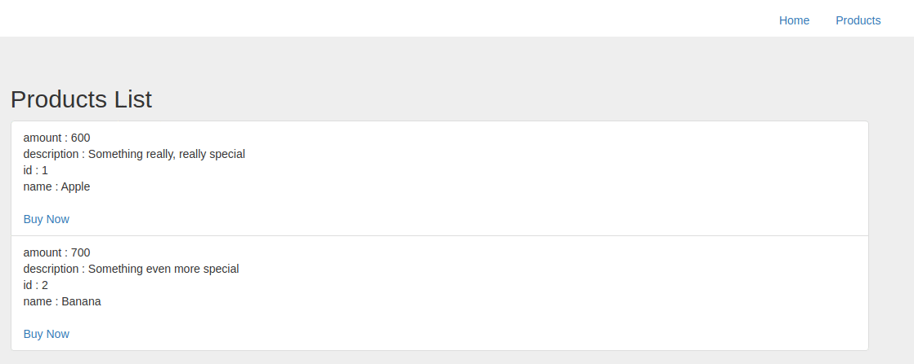

# Stripe Flask Example

An example Stripe integration for python in the Flask framework.

## Setup

1. Configure
Add your Stripe secrete key and publishable key in `.env` file.

2. Install
  ```sh
  $ pip install -r requirements.txt
  ```

3. Start Server
  ```sh
  $ export FLASK_APP=app.py
  $ flask run
  ```

## Demo


